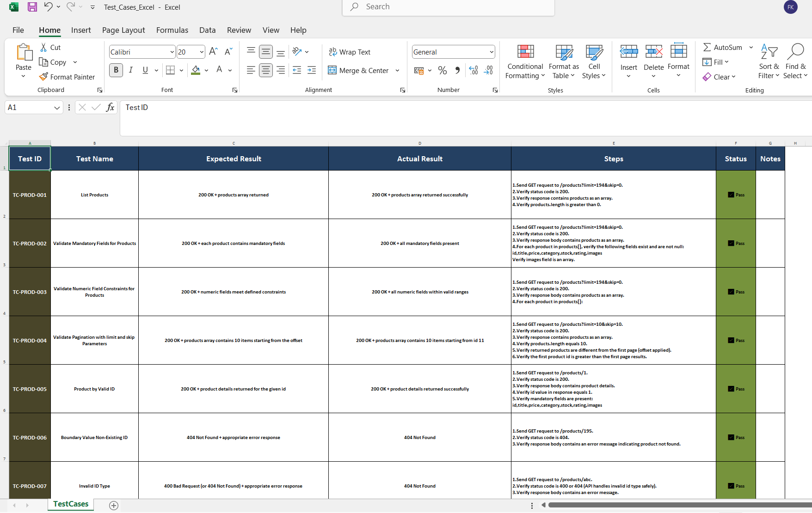

## E-Commerce API Testing 

**Project Overview** 📌 

This project focuses on manual API testing of the DummyJSON E-Commerce APIs.
The goal is to validate core product-related endpoints using real-life QA practices such as structured test cases, boundary testing, negative scenarios, and proper documentation.

🧪 **Scope of Testing**

Products – list & pagination

Mandatory fields validation

Numeric field validation

Page limit & skip scenarios

Boundary value analysis

Negative test cases

🛠 **Tools & Technologies**

Postman – Manual API testing & request validation

Excel – Test case management (manual QA workflow simulation)

Markdown – Detailed test case documentation

Git & GitHub – Version control and project sharing

📂 **Test Artifacts**

✅ Postman Collection

✅ Detailed Test Cases (Markdown)

✅ Test Case Matrix (Excel)

✅ Execution Screenshots

**Project structure:**

E-Commerce API Testing/
│
├── TEST_CASES.md
├── Test_Cases_Excel.xlsx
├── screenshots/
│   ├── mandatory_fields.png
│   ├── numeric_fields.png
│   ├── products_search.png
│   └── valid_id.png

📊 **Test Case Management**(Excel)

In addition to Markdown documentation, test cases were also maintained in Excel format to reflect real-world QA processes such as:

Test case tracking

Execution status (Pass / Fail)

Expected vs Actual results

Manual regression readiness

This approach demonstrates hands-on experience with traditional QA test management practices.

