## TC-PROD-001  GET /products (List Products)

**Endpoint:** GET /products?limit=194&skip=0

**Expected Result:** 
200 OK + products array returned

**Actual Result:** 
200 OK + products array returned successfully

**Result:** ✅ Pass

Steps:

1.Send GET request to /products?limit=194&skip=0.

2.Verify status code is 200.

3.Verify response contains products as an array.

4.Verify products.length is greater than 0.


**Sample Response:**
```json
{
  "products":[
        {
            "id": 1,
            "title": "Essence Mascara Lash Princess",
            "description": "The Essence Mascara Lash Princess is a popular mascara known for its volumizing and lengthening effects. Achieve dramatic lashes with this long-lasting and cruelty-free formula.",
            "category": "beauty",
            "price": 9.99,
            "discountPercentage": 10.48,
            "rating": 2.56,
            "stock": 99,
            "tags": ["beauty", "mascara"]
        }
            ] }
```

Screenshot
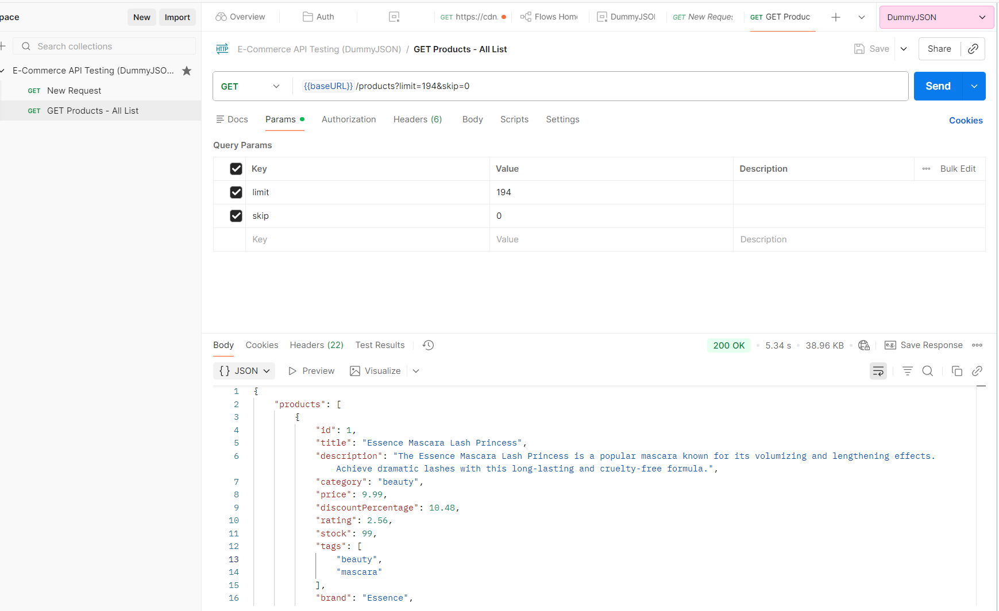


## TC-PROD-002 Validate Mandatory Fields for Products

**Endpoint:** GET /products?limit=194&skip=0

**Expected Result:** 200 OK + each product contains mandatory fields

**Actual Result:** 200 OK + all mandatory fields present

**Result:** ✅ Pass

**Mandatory Fields:**id, title, price, category, stock, rating, images


Steps:

1.Send GET request to /products?limit=194&skip=0.

2.Verify status code is 200.

3.Verify response body contains products as an array.

4.For each product in products[], verify the following fields exist and are not null:

id,title,price,category,stock,rating,images

Verify images field is an array.

**Sample Response:**

```json
{
  "products": [
    {
      "id": 1,
      "title": "Essence Mascara Lash Princess",
      "category": "beauty",
      "price": 9.99,
      "rating": 2.56,
      "stock": 99,
      "images": [
        "https://cdn.dummyjson.com/product-images/beauty/essence-mascara/1.webp"
      ]
    }
  ]
}
```

Screenshot
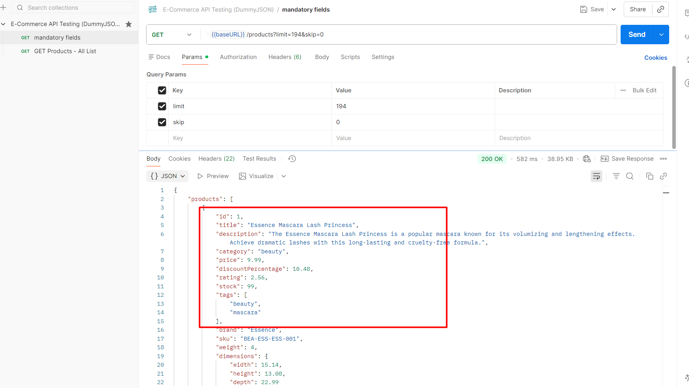
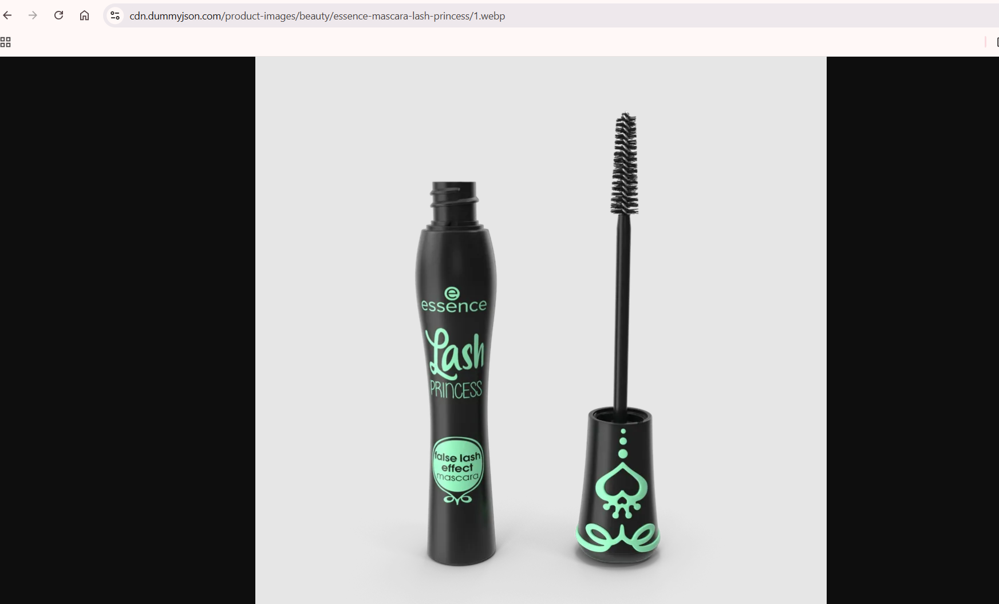

## TC-PROD-003 Validate Numeric Field Constraints for Products

**Endpoint:** GET /products?limit=194&skip=0

**Expected Result:** 200 OK + numeric fields meet defined constraints

**Actual Result:** 200 OK + all numeric fields within valid ranges

**Result:** ✅ Pass

**Validated Numeric Fields & Rules:**
price >= 0
stock >= 0
rating between 0 and 5
discountPercentage between 0 and 100

**Steps:**

1.Send GET request to /products?limit=194&skip=0.

2.Verify status code is 200.

3.Verify response body contains products as an array.

4.For each product in products[]:
Verify price is greater than or equal to 0.
Verify stock is greater than or equal to 0.
Verify rating value is between 0 and 5.
Verify discountPercentage value is between 0 and 100.

5.Confirm no product violates the defined numeric constraints.

**Sample Response:**

```json

{
  "products": [
    {
      "id": 1,
      "price": 9.99,
      "discountPercentage": 10.48,
      "rating": 2.56,
      "stock": 99
    }
  ]
}
```

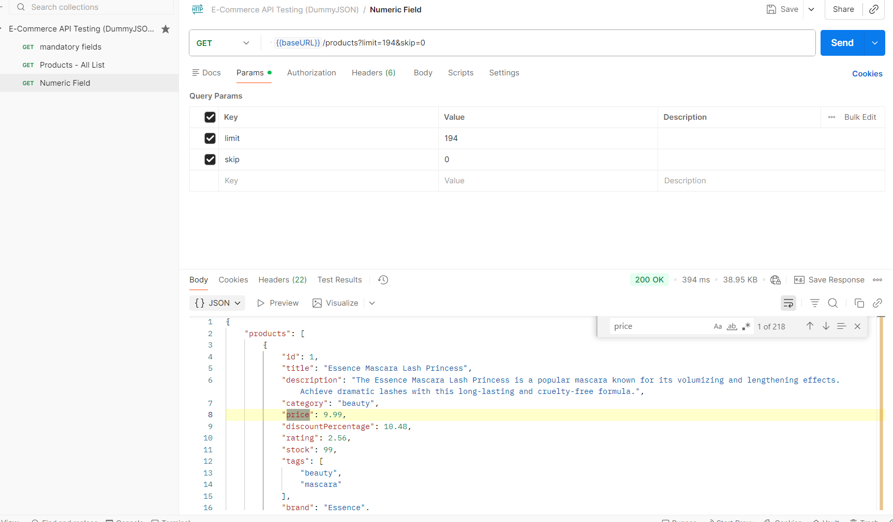

## TC-PROD-004 Validate Pagination with limit and skip Parameters

**Endpoint:** GET /products?limit=10&skip=10

**Expected Result:** 200 OK + products array contains 10 items starting from the offset

**Actual Result:** 200 OK + products array contains 10 items starting from id 11

**Result:** ✅ Pass

Steps:

1.Send GET request to /products?limit=10&skip=10.

2.Verify status code is 200.

3.Verify response contains products as an array.

4.Verify products.length equals 10.

5.Verify returned products are different from the first page (offset applied).

6.Verify the first product id is greater than the first page results.

**Sample Response:**

```json

{
  "products": [
    {
      "id": 11,
      "title": "Annibale Colombo Bed",
      "category": "furniture",
      "price": 1899.99,
      "rating": 4.77,
      "stock": 88
    }
  ]
}

```

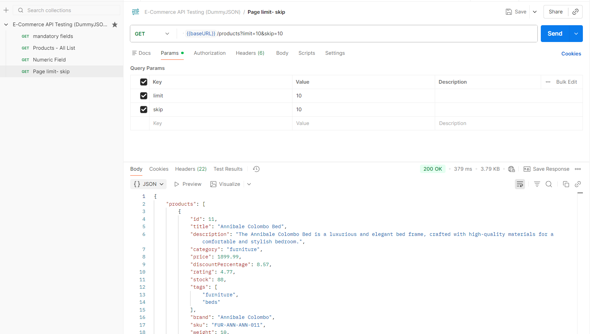

## TC-PROD-005 GET /products/{id} (Get Product by Valid ID)

**Endpoint:** GET /products/1

**Expected Result:**200 OK + product details returned for the given id

**Actual Result:** 200 OK + product details returned successfully

**Result:** ✅ Pass

Steps:

1.Send GET request to /products/1.

2.Verify status code is 200.

3.Verify response body contains product details.

4.Verify id value in response equals 1.

5.Verify mandatory fields are present:
id,title,price,category,stock,rating,images

**Sample Response:**

```json

{
  "id": 1,
  "title": "Essence Mascara Lash Princess",
  "category": "beauty",
  "price": 9.99,
  "rating": 2.56,
  "stock": 99,
  "images": [
    "https://cdn.dummyjson.com/product-images/beauty/essence-mascara/1.webp"
  ]
}
```

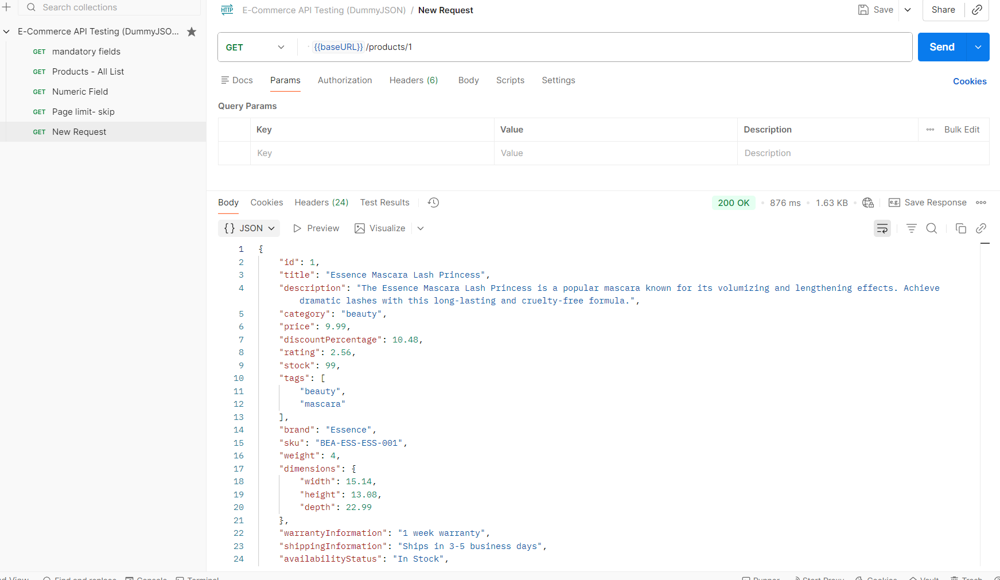


## TC-PROD-006 GET /products/{id} (Boundary Value Non-Existing ID)

**Endpoint:** GET /products/195

**Expected Result:** 404 Not Found + appropriate error response

**Actual Result:** 404 Not Found

**Result:** ✅ Pass

Steps:

1.Send GET request to /products/195.

2.Verify status code is 404.

3.Verify response body contains an error message indicating product not found.

**Sample Response:**

```json

{
  "message": "Product with id '195' not found"
}
```

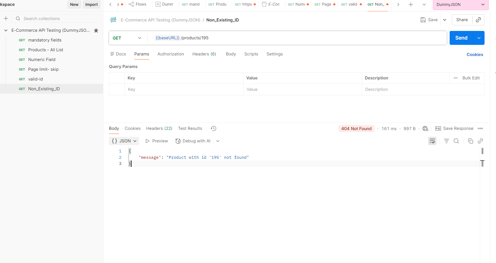

## TC-PROD-007 GET /products/{id} (Invalid ID Type)

**Endpoint:** GET /products/abc

**Expected Result:** 400 Bad Request (or 404 Not Found) + appropriate error response

**Actual Result:** 404 Not Found

**Result:** ✅ Pass

Steps:

1.Send GET request to /products/abc.

2.Verify status code is 400 or 404 (API handles invalid id type safely).

3.Verify response body contains an error message.

**Sample Response:**

```json

{
  "message": "Product with id 'abc' not found"
}

```

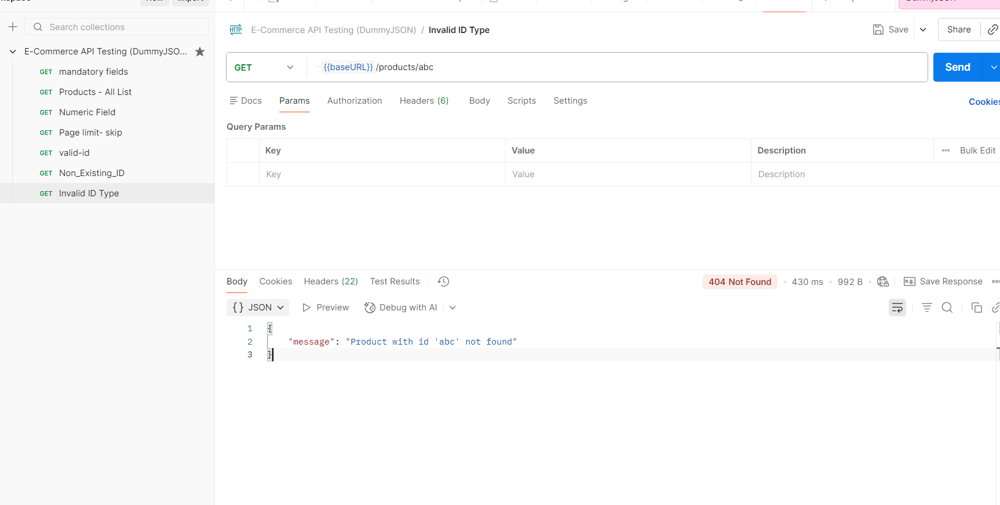

## TC-PROD-008 GET /products/search (Search Products by Keyword)

**Endpoint:** GET /products/search?q=mascara

**Expected Result:** 200 OK + products array returned matching the search keyword

**Actual Result:** 200 OK + products related to the keyword returned

**Result:** ✅ Pass

Steps:

1.Send GET request to /products/search?q=mascara.

2.Verify status code is 200.

3.Verify response body contains products as an array.

4.Verify products.length is greater than 0.

5.Verify returned products contain the keyword mascara in title or description.

**Sample Response:**

```json

{
  "products": [
    {
      "id": 1,
      "title": "Essence Mascara Lash Princess",
      "description": "The Essence Mascara Lash Princess is a popular mascara...",
      "category": "beauty",
      "price": 9.99
    }
  ]
}
```

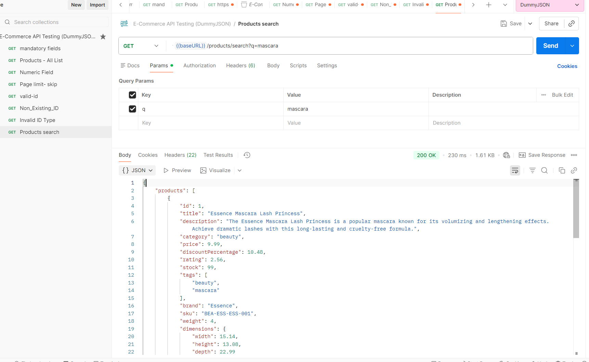

## TC-PROD-009 GET /products/search (Search with Non-Existing Keyword)

**Endpoint:** GET /products/search?q=nonexistingkeyword

**Expected Result:** 200 OK + empty products array returned

**Actual Result:** 200 OK + empty products array returned

**Result:** ✅ Pass

Steps:

1.Send GET request to /products/search?q=nonexistingkeyword.

2.Verify status code is 200.

3.Verify response body contains products as an array.

4.Verify products.length equals 0.

**Sample Response:**

```json

{
  "products": [],
  "total": 0,
  "skip": 0,
  "limit": 30
}

```

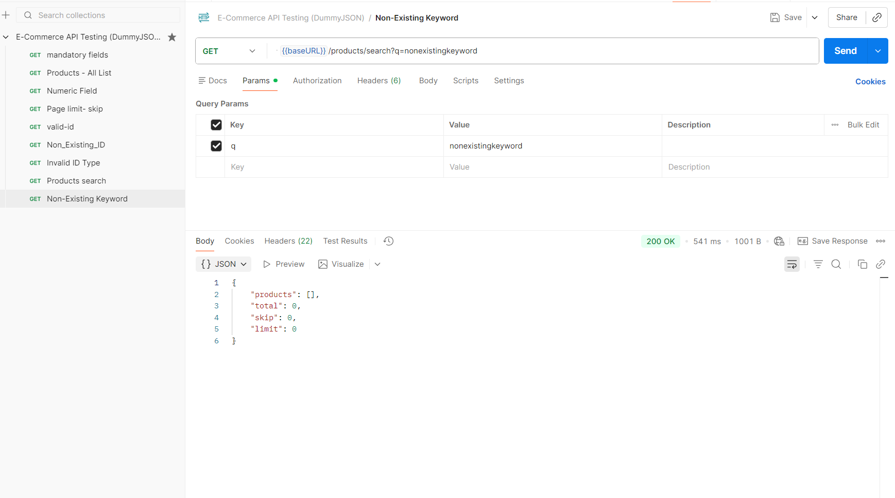

## TC-PROD-010 GET /products (Response Time / Basic Performance Check)

**Endpoint:** GET /products?limit=194&skip=0

**Expected Result:** 200 OK + response time under 2000 ms

**Actual Result:** 200 OK + response time 1.36 seconds

**Result:** ✅ Pass

Steps:

1.Send GET request to /products?limit=194&skip=0.

2.Verify status code is 200.

3.Check response time from Postman.

4.Verify response time is under 2000 ms.

**Sample Response:**

```json

{
  "products": [
    {
      "id": 1,
      "title": "Essence Mascara Lash Princess"
    }
  ]
}

```


## TC-PROD-011 GET /products/category/{category} (Category Filter Works)

**Endpoint:** GET /products/category/beauty
**Expected Result:** 200 OK + products array returned and all products belong to the requested category
**Actual Result:** 200 OK + all returned products have category = beauty
**Result:** ✅ Pass

Steps:

1.Send GET request to /products/category/beauty.
2.Verify status code is 200.
3.Verify response contains products as an array.
4.Verify products.length is greater than 0.
5.For each product in products[], verify category equals beauty.

**Sample Response:**

```json

{
  "products": [
    {
      "id": 1,
      "title": "Essence Mascara Lash Princess",
      "category": "beauty",
      "price": 9.99
    }
  ]
}

```

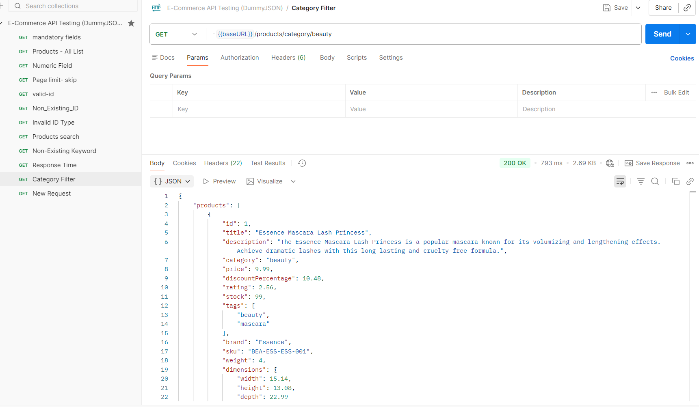


## TC-PROD-012 GET /products/category/{category} (Invalid Category)

**Endpoint:** GET /products/category/invalidcategoryname
**Expected Result:** 200 OK + empty products array returned
**Actual Result:** 200 OK + products array is empty
**Result:** ✅ Pass

Steps:

1.Send GET request to /products/category/invalidcategoryname.
2.Verify status code is 200.
3.Verify response contains products as an array.
4.Verify products.length equals 0.
5.Verify total equals 0.

**Sample Response:**

```json

{
  "products": [],
  "total": 0,
  "skip": 0,
  "limit": 0
}

```

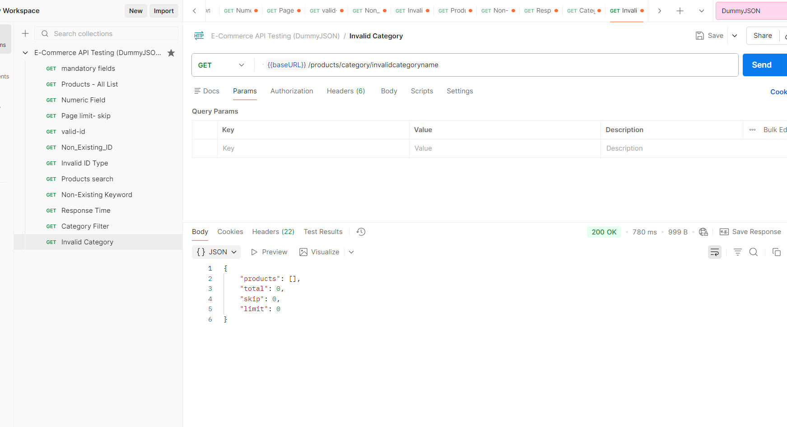


## TC-PROD-013 Validate SKU Uniqueness (Data Consistency)

**Endpoint:** GET /products?limit=194&skip=0
**Expected Result:** 200 OK + all sku values are unique
**Actual Result:** 200 OK + no duplicate sku values observed (validated via Excel)
**Result:** ✅ Pass

Steps:

1.Send GET request to /products?limit=194&skip=0.
2.Verify status code is 200.
3.Verify response contains products as an array.
4.Verify each product contains a sku field.
5.Export response data and perform duplicate check on sku values using Excel.
6.Confirm no duplicate sku values exist in the dataset.

**Sample Response:**

```json

{
    "products": [
        {
            "id": 1,
            "title": "Essence Mascara Lash Princess",
            "description": "The Essence Mascara Lash Princess is a popular mascara known for its volumizing and lengthening effects. Achieve dramatic lashes with this long-lasting and cruelty-free formula.",
            "category": "beauty",
            "price": 9.99,
            "discountPercentage": 10.48,
            "rating": 2.56,
            "stock": 99,
            "tags": [
                "beauty",
                "mascara"
            ],
            "brand": "Essence",
            "sku": "BEA-ESS-ESS-001",
            "weight": 4,
            "dimensions": {
                "width": 15.14,
                "height": 13.08,
                "depth": 22.99
            } }
             ]  }

```

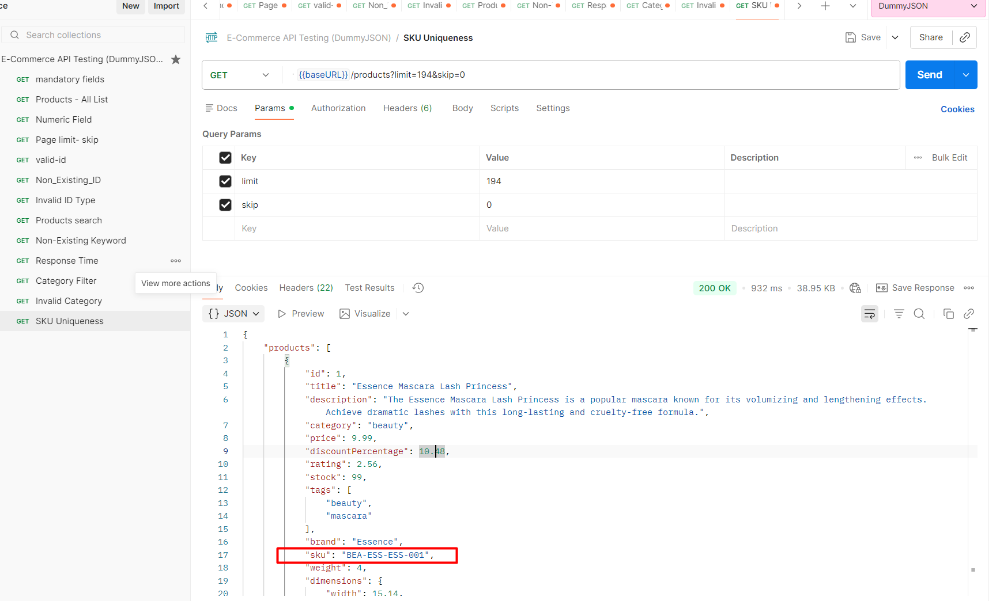


## TC-PROD-014 Search with Special Characters

**Endpoint:** GET /products/search?q=ç%ü'
**Expected Result:** 200 OK + API handles special characters safely (returns empty or valid products array)
**Actual Result:** 200 OK + empty products array returned
**Result:** ✅ Pass

Steps:

1.Send GET request to /products/search?q=ç%ü'.
2.Verify status code is 200.
3.Verify response contains products as an array.
4.Verify API does not return error (500 / 400).
5.Verify products.length is 0 or response is safely handled.

**Sample Response:**

```json

{
  "products": [],
  "total": 0,
  "skip": 0,
  "limit": 30
}

```

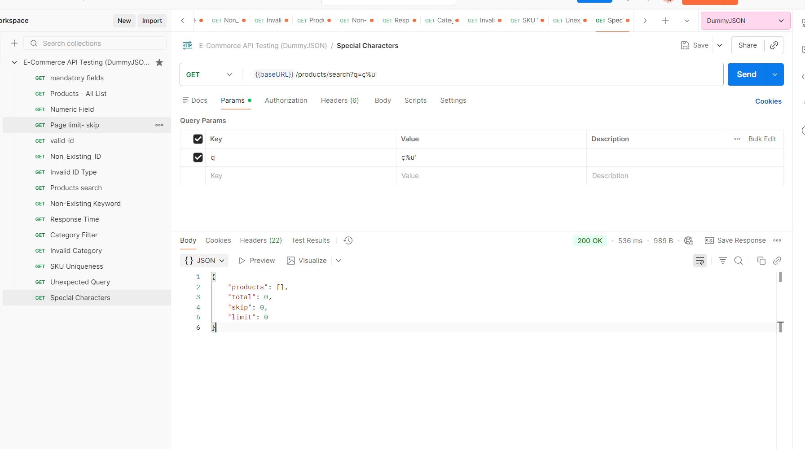

## TC-PROD-015 Pagination Consistency (Same Request Returns Same Results)

**Endpoint:** GET /products?limit=10&skip=0
**Expected Result:** 200 OK + same request returns the same first product (id) and same response structure
**Actual Result:** 200 OK + same request sent 3 times, first product id remained 1 and response stayed consistent
**Result:** ✅ Pass

Steps :

1.Send GET request to /products?limit=10&skip=0 (1st run).
2.Verify status code is 200.
3.Verify products array and products.length = 10.
4.Note products[0].id.
5.Send the same request 2 more times.
6.Verify products[0].id is the same across runs.
7.Verify structure unchanged (products, total, skip, limit).

**Sample Response:**

```json

{
  "products": [
    {
      "id": 1,
      "title": "Essence Mascara Lash Princess"
    }
  ],
  "total": 194,
  "skip": 0,
  "limit": 10
}

```

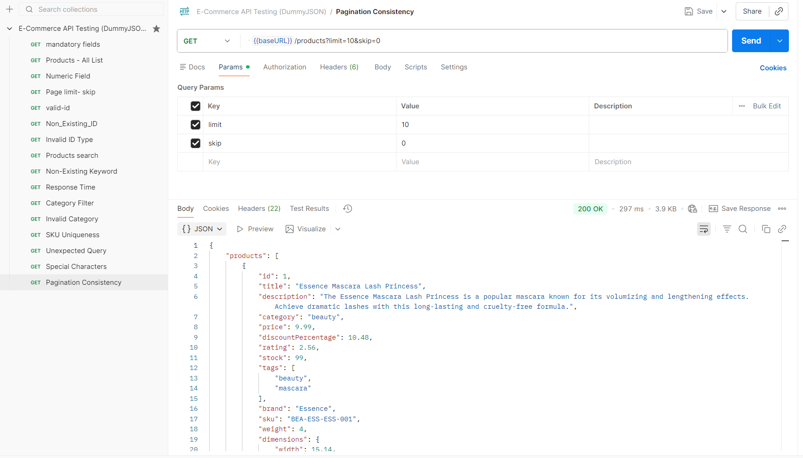

## TC-PROD-016 Boundary Value: limit=0 handled as default

**Endpoint:** GET /products?limit=0&skip=0
**Expected Result:** 200 OK + API ignores limit=0 and returns default product list
**Actual Result:** 200 OK + all products returned (limit defaults to 194)
**Result:** ✅ Pass (Behavior observed as designed)

Steps:

1.Send GET request to /products?limit=0&skip=0.
2.Verify status code is 200.
3.Verify response contains products as an array.
4.Verify products array is not empty.
5.Verify response structure remains unchanged (products, total, skip, limit).

**Sample Response:**

```json

{
  "products": [{
            "id": 1,
            "title": "Essence Mascara Lash Princess",
            "description": "The Essence Mascara Lash Princess is a popular mascara known for its volumizing and lengthening effects. Achieve dramatic lashes with this long-lasting and cruelty-free formula.",
            "category": "beauty",
            "price": 9.99,
            "discountPercentage": 10.48,
            "rating": 2.56,
            "stock": 99,
            "tags": [
                "beauty",
                "mascara"]}
            ],
  "total": 194,
  "skip": 0,
  "limit": 194
}

```

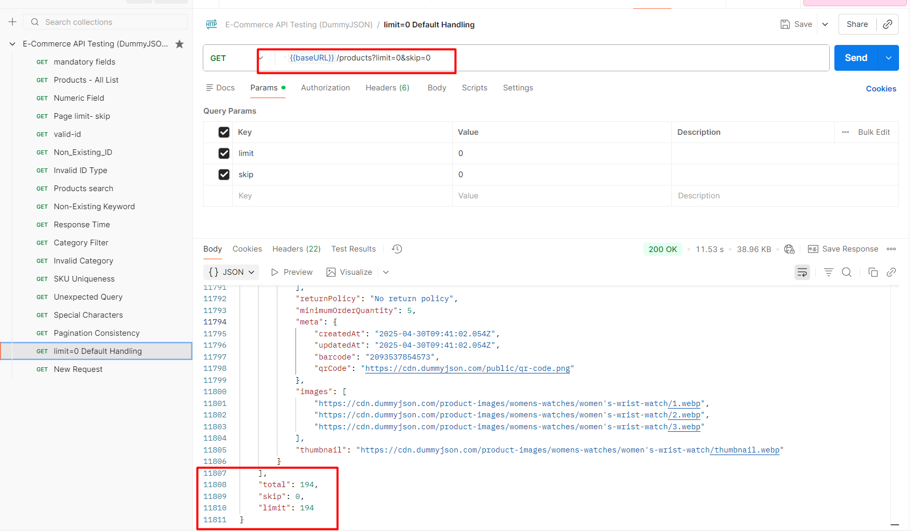


## TC-PROD-017 Unexpected Query Parameter Ignored

**Endpoint:** GET /products?limit=10&skip=0&foo=bar  
**Expected Result:** 200 OK + response structure remains unchanged (products, total, skip, limit)  
**Actual Result:** 200 OK + response returned successfully, structure unchanged  
**Result:** ✅ Pass

Steps:

1.Send GET request to /products?limit=10&skip=0&foo=bar.  
2.Verify status code is 200.  
3.Verify response contains products as an array.  
4.Verify products.length equals 10.  
5.Verify response structure remains unchanged (products, total, skip, limit).  

**Sample Response:**
```json
{
  "products": [
    {
      "id": 1,
      "title": "Essence Mascara Lash Princess"
    }
  ],
  "total": 194,
  "skip": 0,
  "limit": 10
}

```

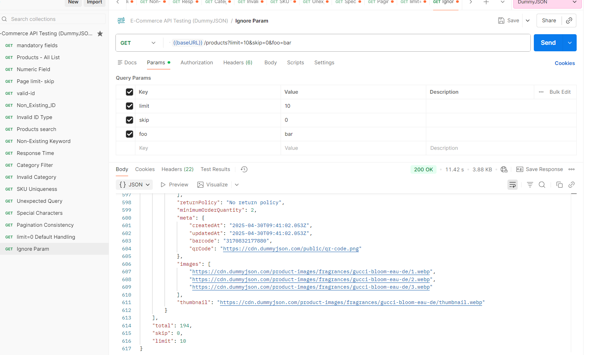

## TC-PROD-018  Search Case Sensitivity Handling

**Endpoint:** GET /products/search?q=mascara
              GET /products/search?q=MASCARA

**Expected Result:**200 OK + both requests return the same results (case-insensitive search)
**Actual Result:**200 OK + same products returned for both lowercase and uppercase queries
**Result:** ✅ Pass

Steps:

1.Send GET request to /products/search?q=mascara.
2.Verify status code is 200.
3.Note the first product id/title.
4.Send GET request to /products/search?q=MASCARA.
5.Verify status code is 200.
6.Verify returned products match the lowercase query results.
7.Verify response structure remains unchanged.

**Sample Response:**

```json
{
  "products": [
    {
      "id": 1,
      "title": "Essence Mascara Lash Princess"
    }
  ],
  "total": 1
}
```

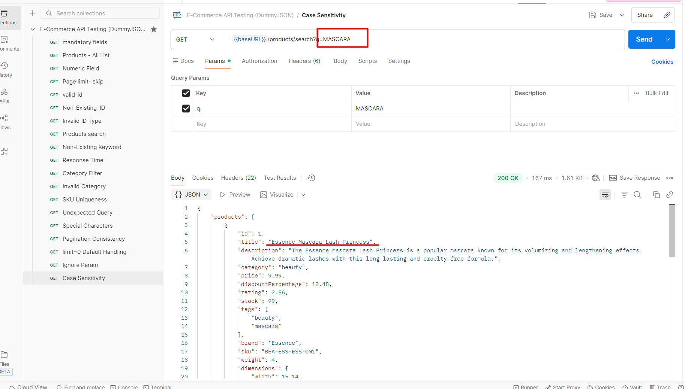

## TC-PROD-019  Search Whitespace Handling

**Endpoint:** GET /products/search?q=  mascara
**Expected Result:**200 OK + API trims leading/trailing whitespaces and returns the same results
**Actual Result:**200 OK + same products returned for both requests
**Result:** ✅ Pass

Steps:

1.Send GET request to /products/search?q= mascara.
2.Verify status code is 200.
3.Note the first product id/title.
4.Send GET request to /products/search?q=mascara.
5.Verify status code is 200.
6.Verify returned products match between both requests.
7.Verify response structure remains unchanged (products, total, skip, limit).

**Sample Response:**

```json
{
  "products": [
    {
      "id": 1,
      "title": "Essence Mascara Lash Princess"
    }
  ],
  "total": 1
}
```

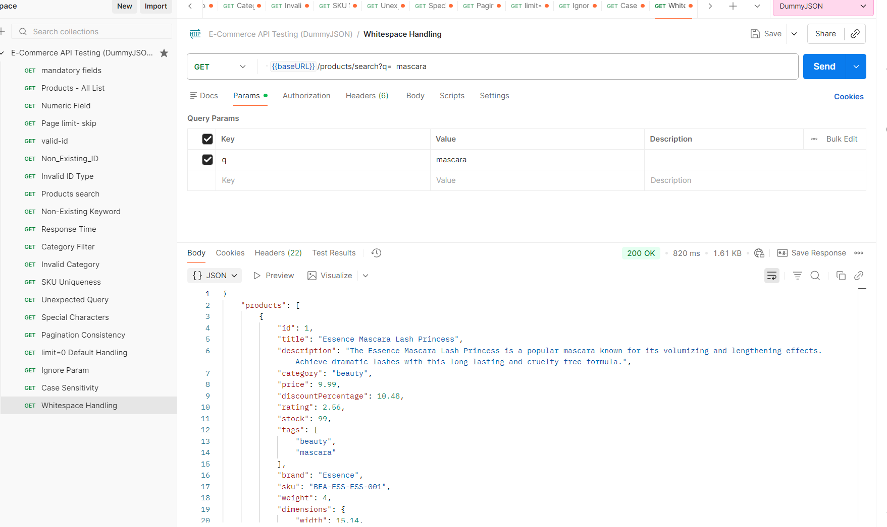

## TC-PROD-020 Boundary Value: skip Greater Than Total

**Endpoint:** GET /products?limit=10&skip=999
**Expected Result:** 200 OK + products array is empty (skip exceeds total)
**Actual Result:** 200 OK + products array is empty, total=194, skip=999, limit=0
**Result:** ✅ Pass

Steps:

1.Send GET request to /products?limit=10&skip=999
2.Verify status code is 200.
3.Verify response contains products as an array.
4.Verify products.length equals 0.
5.Verify total equals 194.
6.Verify skip equals 999.
7.Verify limit returned by API equals 0 (API behavior observed).

**Sample Response:**

```json

{
  "products": [],
  "total": 194,
  "skip": 999,
  "limit": 0
}

```


## TC-PROD-021 Upper Boundary: Very Large Limit Value

**Endpoint:** GET /products?limit=9999&skip=0
**Expected Result:** 200 OK + API applies max/default limit and returns valid response
**Actual Result:** 200 OK + API returned all available products (capped behavior)
**Result:** ✅ Pass

Steps:

1.Send GET request to /products?limit=9999&skip=0.
2.Verify status code is 200.
3.Verify response contains products as an array.
4.Verify products.length does not exceed total available products.
5.Verify API does not return error (400 / 500).

**Sample Response:**

```json

{
  "products": [ { "id": 1 } ],
  "total": 194,
  "skip": 0,
  "limit": 194
}

```

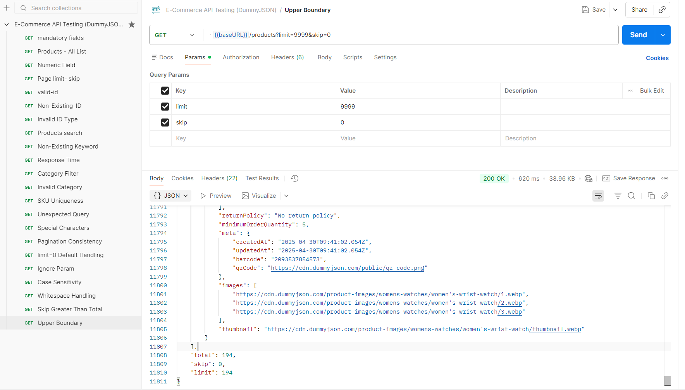


## TC-PROD-022  Invalid Query Parameter Type Handling (limit)

Endpoint:GET /products?limit=abc&skip=0
Expected Result:400 Bad Request + meaningful validation error message
Actual Result:400 Bad Request + "Invalid 'limit' - must be a number"
Result: ✅ Pass

Steps:

1.Send GET request to /products?limit=abc&skip=0
2.Verify status code is 400
3.Verify response body contains a clear validation error message
4.Verify API does not return 500 (graceful error handling)

**Sample Response:**

```json
{
  "message": "Invalid 'limit' - must be a number"
}

```

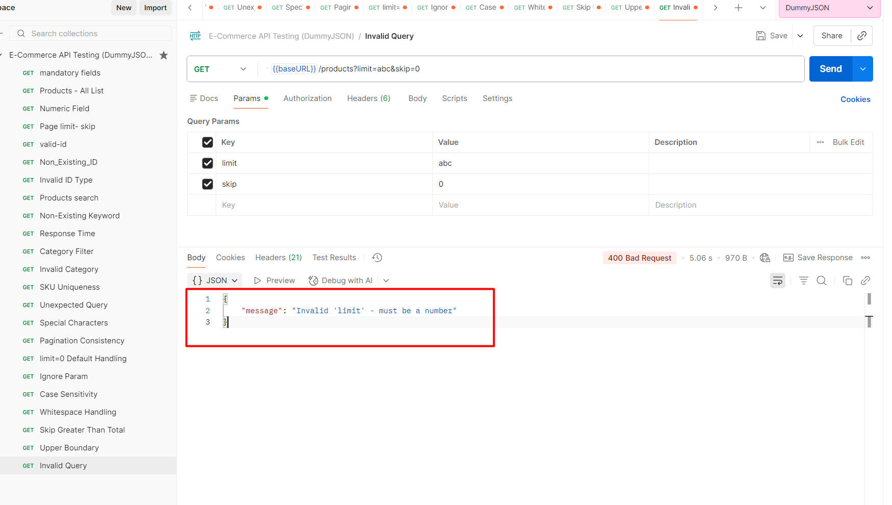


## TC-PROD-023 Validate Negative limit Handling

**Endpoint:** GET /products?limit=-1&skip=0
**Expected Result:**200 OK + API normalizes negative limit and returns a valid product list (no error)
**Actual Result:**200 OK + API returned 193 products (limit normalized internally)
**Result:** ✅ Pass (Behavior observed as designed)

Steps:

1.Send GET request to /products?limit=-1&skip=0.
2.Verify status code is 200.
3.Verify response contains products as an array.
4.Verify API does not return 400 / 500.
5.Verify products.length equals 193.
6.Verify response structure remains unchanged (products, total, skip, limit).

**Sample Response:**

```json
{
  "products": [ { "id": 1 } ],

  "total": 194,
  "skip": 0,
  "limit": 193
} 

```

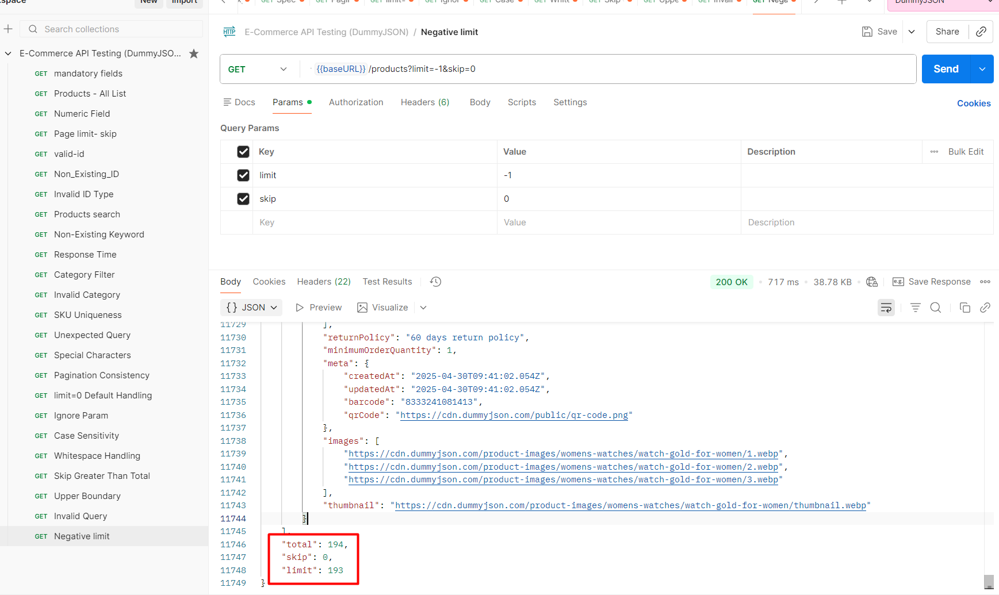

## TC-PROD-024  Negative Skip Value Handling

**Endpoint:**GET /products?limit=10&skip=-1
**Expected Result:**API should handle negative skip safely (either normalize to 0 or return validation error)
**Actual Result:**200 OK. Products list returned successfully skip value returned as -1 in response
**Result:** ✅ Pass (API handles negative value without failure)

Steps:

1.Send GET request to /products?limit=10&skip=-1
2.Verify status code is 200
3.Verify response contains products as an array
4.Verify products.length equals 10
5.Verify response includes skip = -1
6.Verify API does not return 400 / 500 error

**Sample Response:**

```json

{
  "products": [ { "id": 1 } ],
  "total": 194,
  "skip": -1,
  "limit": 10
}

```

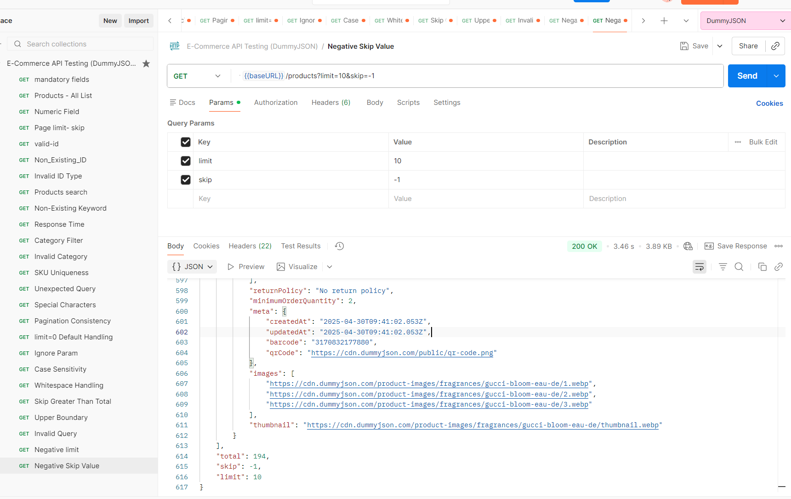

## TC-PROD-025 Invalid Skip Type Validation (skip=abc)

**Endpoint:** GET /products?limit=10&skip=abc
**Expected Result:**API should reject non-numeric skip value.400 Bad Request returned with a clear validation message
**Actual Result:**400 Bad Request returned.Error message indicates invalid skip type
**Result:** ✅ Pass

Steps:

1.Send GET request to /products?limit=10&skip=abc
2.Verify status code is 400
3.Verify response contains an error message
4.Verify message indicates skip must be a number
5.Verify API does not return 500 (no crash)

**Sample Response:**

```json

{
  "message": "Invalid 'skip' - must be a number"
}

```

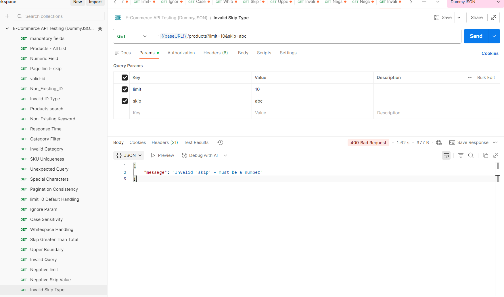


## TC-PROD-026 Select Parameter Returns Only Requested Fields

**Endpoint:** GET /products?limit=10&skip=0&select=title,price
**Expected Result:** 200 OK + each product object contains only id, title, price (and does not include other fields)
**Actual Result:** 200 OK + selected fields returned as expected
**Result:** ✅ Pass

Steps:

1.Send GET request to /products?limit=10&skip=0&select=title,price.
2.Verify status code is 200.
3.Verify response contains products as an array and products.length = 10.
4.For each item in products[], verify these fields exist: id, title, price.
5.For each item, verify these fields do NOT exist (examples: description, category, stock, rating, discountPercentage, images, tags, brand, sku, dimensions, weight.)
6.Verify response structure still includes: products, total, skip, limit.

**Sample Response:**

```json

{
  "products": [
    {
      "id": 1,
      "title": "Essence Mascara Lash Princess",
      "price": 9.99
    }
  ],
  "total": 194,
  "skip": 0,
  "limit": 10
}

```

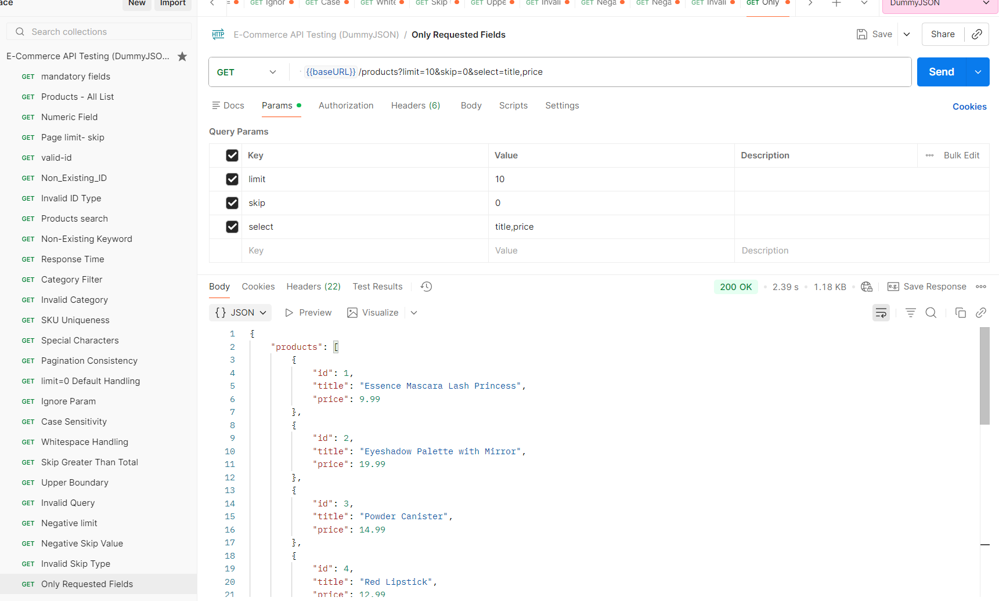


## TC-PROD-027  Sort Products by Title (ASC)

**Endpoint:** GET /products?sortBy=title&order=asc
**Expected Result:** 200 OK + products are sorted by title in ascending (A → Z) order
**Actual Result:** 200 OK + products returned sorted by title ascending
**Result:** ✅ Pass

Steps:

1.Send GET request to /products?sortBy=title&order=asc.
2.Verify status code is 200.
3.Verify response contains products as an array.
4.Verify products.length is greater than 1.
5.Compare consecutive items and verify:products[i].title ≤ products[i+1].title (alphabetical order).
6.Verify response structure remains unchanged (products, total, skip, limit).

**Sample Response:**

```json

{
  "products": [
    {
            "id": 167,
            "title": "300 Touring"
        },
        {
            "id": 99,
            "title": "Amazon Echo Plus"
        } ] }
        
```

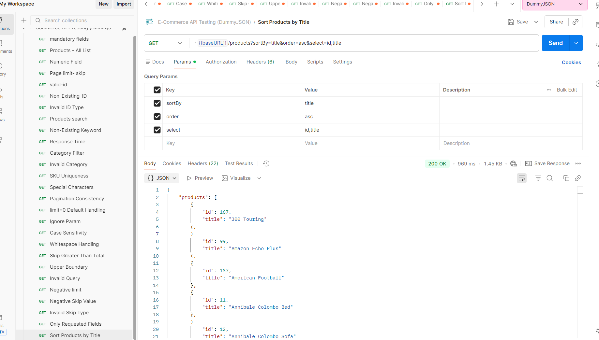

## TC-PROD-028 Get All Products Categories (Objects)

**Endpoint:** GET /products/categories
**Expected Result:** 200 OK + response returns an array of category objects containing slug, name, and url
**Actual Result:** 200 OK + categories returned successfully with required fields
**Result:** ✅ Pass

Steps:

1.Send GET request to /products/categories.
2.Verify status code is 200.
3.Verify response body is an array.
4.Verify each item in the array is an object.
5.Verify each object contains the following fields:slug/name/url
6.Verify none of these fields are null or empty.

**Sample Response:**

```json
[
  {
    "slug": "beauty",
    "name": "Beauty",
    "url": "https://dummyjson.com/products/category/beauty"
  }
]
```

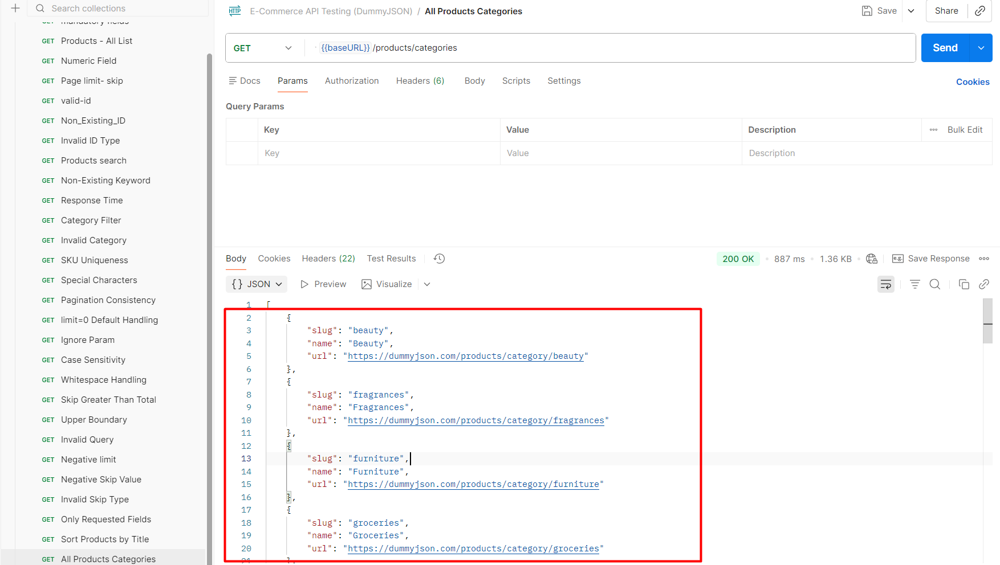

## TC-PROD-029  Get Products Category List 

**Endpoint:**GET /products/category-list
**Expected Result:**200 OK + response returns an array of category slugs (strings)
**Actual Result:**200 OK + category slugs returned successfully
**Result:** ✅ Pass

Steps:

1.Send GET request to /products/category-list.
2.Verify status code is 200.
3.Verify response body is an array.
4.Verify each item in the array is of type string.
5.Verify array is not empty.

**Sample Response:**

```json
[
  "beauty",
  "fragrances",
  "furniture",
  "groceries"
]
```

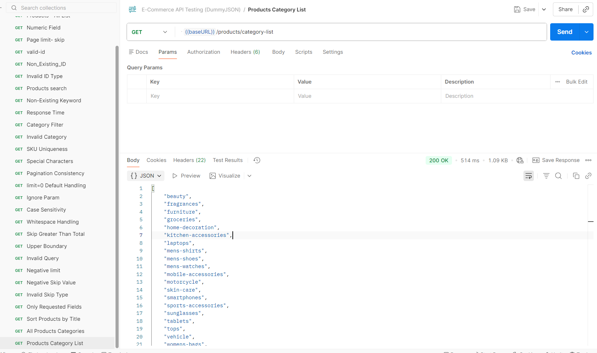

## TC-PROD-030 Search with Empty Query 

**Endpoint:** GET /products/search?q=
**Expected Result:** 200 OK + API treats empty search query as no filter and returns default product list
**Actual Result:**200 OK + all products returned 
**Result:** ✅ Pass 

Steps:

1.Send GET request to /products/search?q=.
2.Verify status code is 200.
3.Verify response contains products as an array.
4.Verify products.length is greater than 0.
5.Verify response structure includes products, total, skip, limit.
6.Verify returned products match default product list behavior.

**Sample Response:**

```json
{
  "products": [
    {
      "id": 1,
      "title": "Essence Mascara Lash Princess"
    }
  ],
  "total": 194,
  "skip": 0,
  "limit": 30
}
```

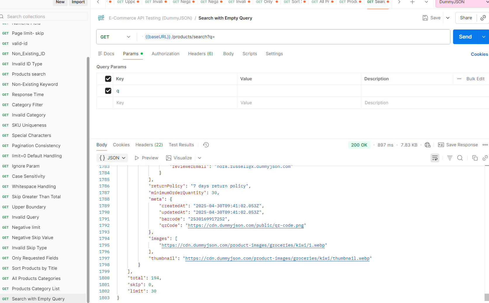

## TC-PROD-031 Search with Whitespace-Only Query

**Endpoint:**GET /products/search?q=
**Expected Result:**200 OK + API trims whitespace-only query and returns default product list
**Actual Result:**200 OK + all products returned (same as empty query behavior)
**Result:** ✅ Pass

Steps:

1.Send GET request to /products/search?q= .
2.Verify status code is 200.
3.Verify response contains products as an array.
4.Verify products.length is greater than 0.
5.Verify response structure includes products, total, skip, limit.
6.Verify behavior matches TC-PROD-030 (empty query).

**Sample Response:**

```json
{
  "products": [
    {
      "id": 1,
      "title": "Essence Mascara Lash Princess"
    }
  ],
  "total": 194,
  "skip": 0,
  "limit": 30
}
```

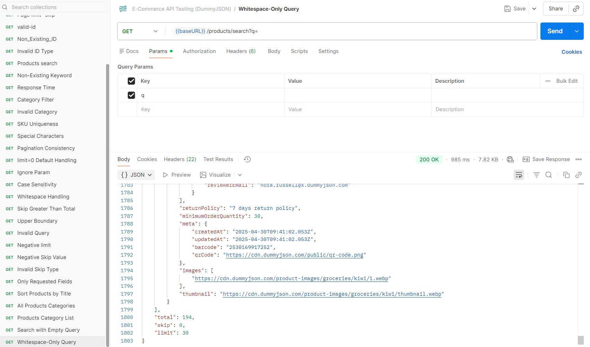

## TC-PROD-032 Select + Search Combined

**Endpoint:**GET /products/search?q=mascara&select=id,title
**Expected Result:**200 OK + products array returned containing only selected fields (id, title)
**Actual Result:**200 OK + products returned with only id and title fields
**Result:** ✅ Pass

Steps:

1.Send GET request to /products/search?q=mascara&select=id,title.
2.Verify status code is 200.
3.Verify response contains products as an array.
4.Verify products.length is greater than 0.
5.For each product in products[], verify:id field exists ,title field exists
  No other product fields are present (e.g. price, category, stock).

**Sample Response:**

```json

{
  "products": [
    {
      "id": 1,
      "title": "Essence Mascara Lash Princess"
    }
  ],
  "total": 1,
  "skip": 0,
  "limit": 1
}
```

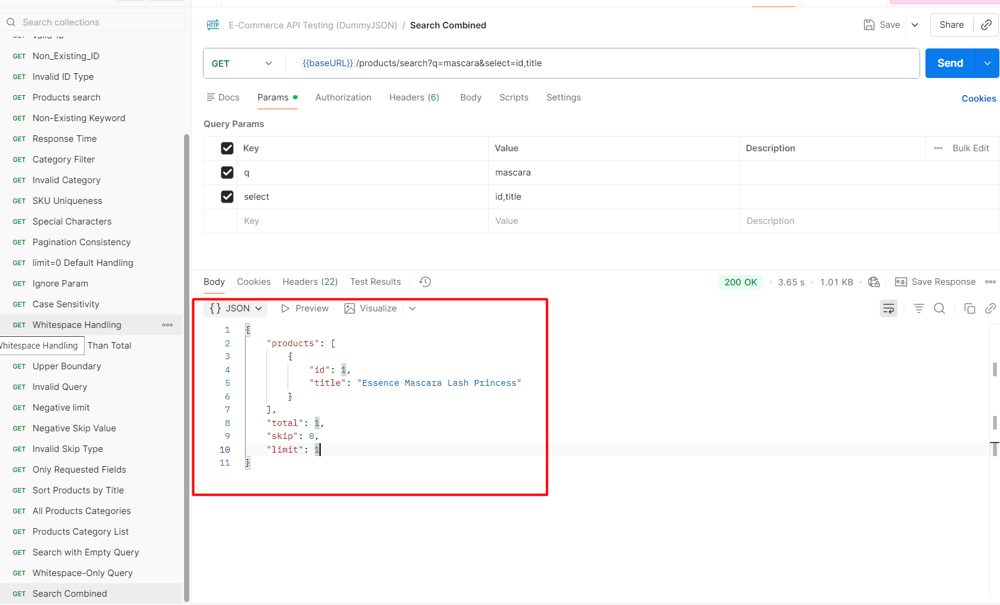

## TC-PROD-033 Select + Pagination Combined

**Endpoint:**GET /products?limit=5&skip=5&select=id,title
**Expected Result:**200 OK + yalnızca seçilen alanlar (id, title) döner ve pagination doğru uygulanır.
**Actual Result:**200 OK + 5 ürün döndü, sadece id ve title alanları mevcut.
**Result:** ✅ Pass

Steps:

1.Send GET request to /products?limit=5&skip=5&select=id,title
2.Verify status code is 200
3.Verify response contains products as an array
4.Verify products.length equals 5
5.Verify each product contains only id and title
6.Verify pagination metadata exists (total, skip, limit)
7.Verify returned products are different from the first page (skip applied)

**Sample Response:**

```json

{
  "products": [
      {
            "id": 6,
            "title": "Calvin Klein CK One"
        },
  ],
  "total": 194,
  "skip": 5,
  "limit": 5
}
```


